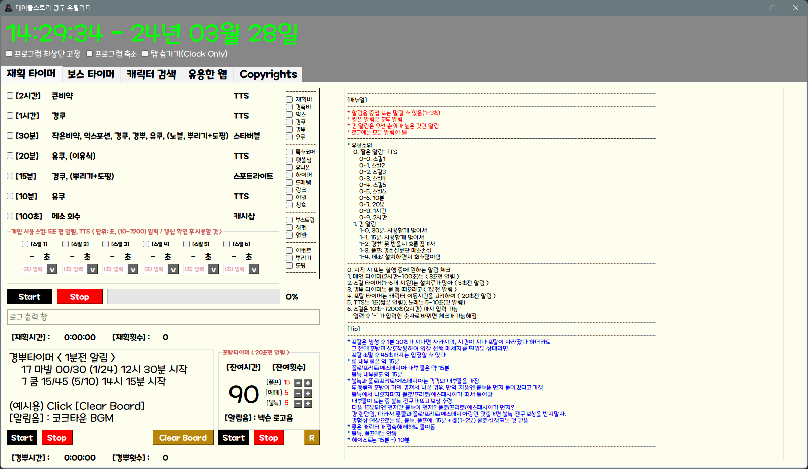
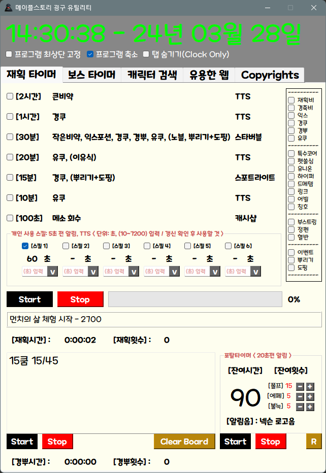
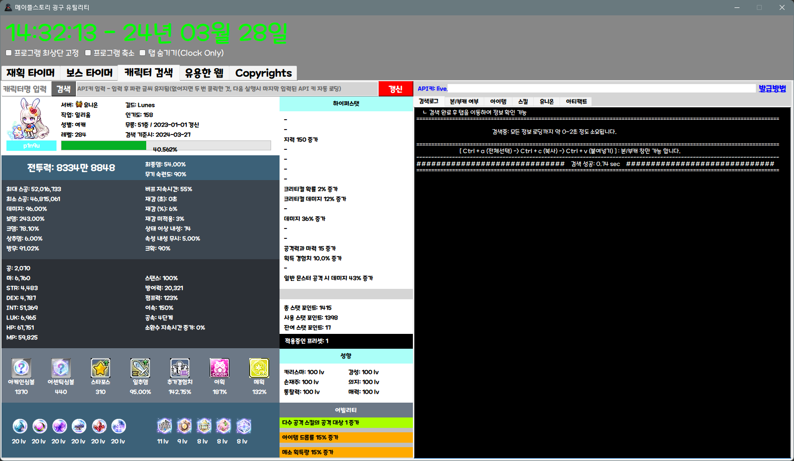
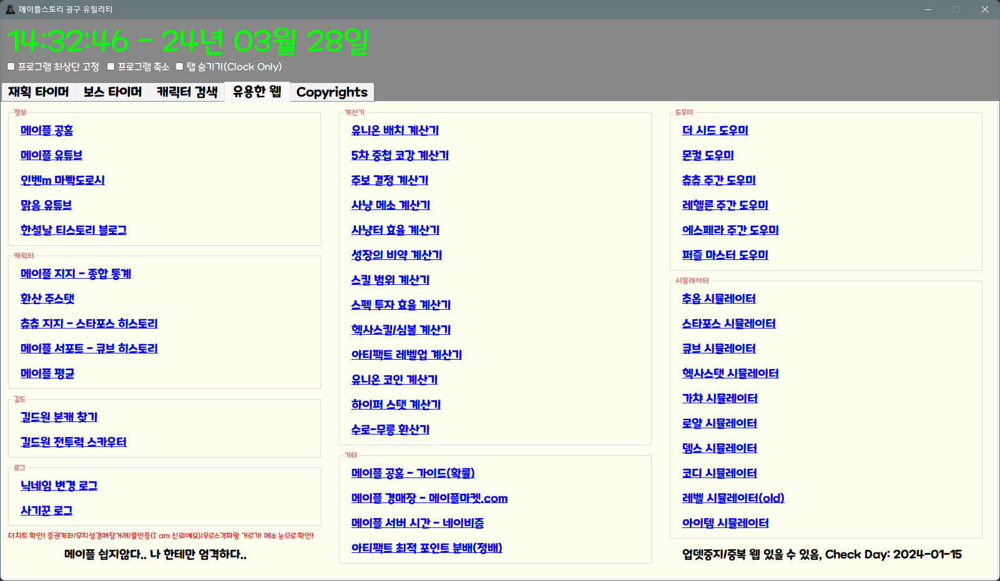
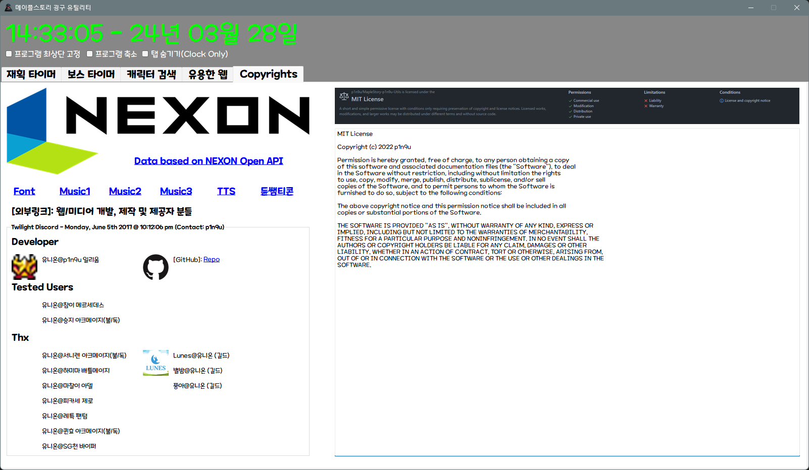

# 메이플스토리 재획 타이머 (굉구 유틸리티)

## MapleStory Wealth Acquisition Timer (p1n9u utilites)

New Version Release : 2024-01-26

### Download

- v3.1.1
    - [Dropbox](https://www.dropbox.com/scl/fi/99ue6bm2jw7bxz0dyni7p/_240126.zip?rlkey=apcw386sdtklmx0x4hxj4bpbg&dl=0) : LTS Version
        - MSp1n9utils.exe: 실행 파일
        - MaplestoryFont_TTF: 메이플스토리 폰트, 설치 권장
        - log: 프로그램 에러 로그 기록
        - nexon_api_key: 사용자의 넥슨 오픈 API 키 저장
        - 매뉴얼
        - 패치노트
    - [Blog](https://p1n9u.com)

### Version

- v3.1.1-240126 : LTS, Testing..
    - 메인 탭 시작 화면 고정
- v3.1.0-240126
    - 캐릭터 검색 탭 UI 변경
    - 캐릭터 검색 탭 검색 로그 로직 변경
    - 캐릭터 검색 탭 아티팩트 검색 기능 추가
    - API request close 누락 패치 
- v3.0.3-240125
    - 캐릭터 검색 탭 오류 수정
    - 캐릭터 검색 성능 향상 (라이브러리 및 코드 수정)
- v3.0.2-240125
    - 폴프 타이머 오류 수정
    - 재획 타이머 ui 수정
- v3.0.1-240125 
    - 에러 로깅 기능 추가
    - 화면 상단 고정 기능 추가
- v3.0.0-240124
    - update feature
        1. v2: 재획타이머 개선
        2. 보스타이머 추가: 칼로스 + 웹/미디어
        3. 캐릭터검색 추가: 넥슨 OPEN API
        4. 웹사이트 와드 추가: 웹/미디어
        5. 카피라이트 추가: Licenses
- v2.0.2-230622
    - 농기구 멘트 가독성 패치
- v2.0.1-230622
    - 시간밀림현상 수정
- v2.0.0-230622
    - update feature
        1. 메인 스킬 UI 분리
        2. 경뿌 타이머 추가
        3. 폴프 타이머 추가
        4. 준비물 체크박스 추가
- v1.0.0-beta : 2023-02-24
- v0.0.0-alpha : 2022-06-10


### Interface

- 메인 화면 <br>

- 시계 전용(전체 최소화) <br>

- 재획 화면(설명서 최소화) <br>

- 캐릭터 검색(1일 전) <br>

- 웹 와드 <br>

- Copyrights
 


### Dev

1. Python 3.11.6
2. pyinstaller 6.3.0
3. PyQt5 designer 5.14.1 (install by pip install pyqt5designer, exec command: $ designer)


### Build


1. Build : pyinstaller --clean --onefile --noconsole --icon="./resources/icon/favicon.ico" --add-data="./resources/*;." -n MSp1n9utils App.py

    - Use Windows PowerShell
        - [reference](https://flytrap.tistory.com/entry/pyinstaller-%EC%9A%A9%EB%9F%89-%EC%A4%84%EC%9D%B4%EB%8A%94-%EB%B0%A9%EB%B2%95-230MB-36MB)

2. modify RiceHarvester.spec file

    ```
    added_files=[
        ('./resources/snd/*', './resources/snd'),
        ('./resources/ui/*', './resources/ui'),
        ('./resources/icon/*', './resources/icon'),
        ('./resources/img/*', './resources/img'),
        ('./log/*', './log'),
        ('./nexon_api_key/*', './nexon_api_key')
    ]

    a = Analysis(
        ...
        datas=added_files,
        ...
    )
    ```

3. pyinstaller .\MSp1n9utils.spec
