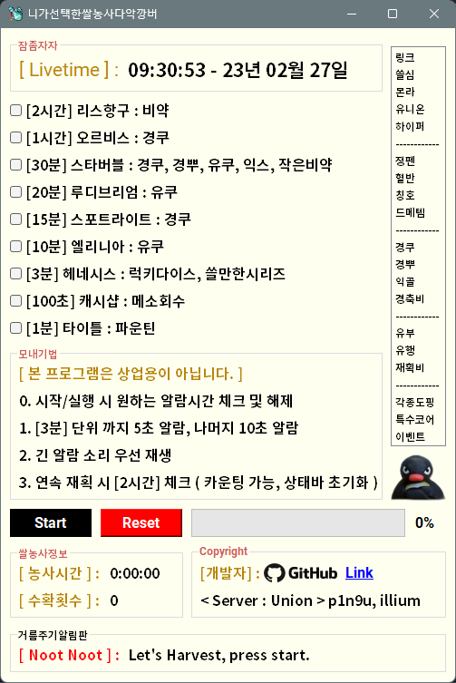
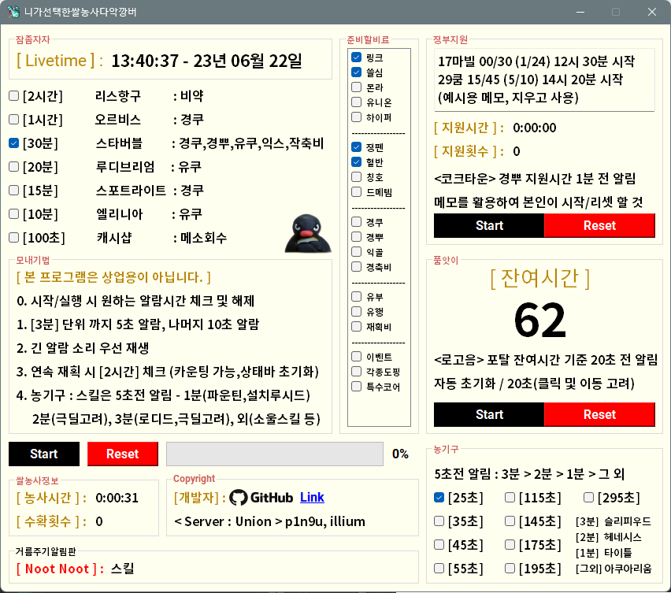

# 메이플스토리 재획 타이머

## MapleStory Wealth Acquisition Timer

New Version Release : 2023-06-22

### Download

- [Blog](https://p1n9u.com/projects/2022-06-10-mapleStory-wealth-acquisition-timer/)
- [Dropbox](https://www.dropbox.com/scl/fi/o3dsqfcbhxc4zwenzq32v/_230622-2.zip?dl=0&rlkey=b10lnhk4julwkf63ju8o58w88)  
    - exe file  
    - google fonts  
        - [Roboto](https://fonts.google.com/specimen/Roboto)  
        - [Noto Sans Korean](https://fonts.google.com/noto/specimen/Noto+Sans+KR)  
    - 다운받고 압축풀고 사용. 글자 밀림 현상 수정을 원하면 폰트 설치.  

### Version

- v2.0.2-230622 : Latest, ZIP FILE(재획타이머_230622-2)
    - 농기구 멘트 가독성 패치
- v2.0.1-230622
    - 시간밀림현상 수정
- v2.0.0-230622
    - update feature
        1. 메인 스킬 UI 분리
        2. 경뿌 타이머 추가
        3. 폴프 타이머 추가
        4. 준비물 체크박스 추가
- v1.0.0-beta : 2023-02-24
- v0.0.0-alpha : 2022-06-10

### In Game

- Developer
    - [유니온@p1n9u 일리움](https://maple.gg/u/p1n9u)
- Tested Users
    - [유니온@참이: 메르세데스](https://maple.gg/u/%EC%B0%B8%EC%9D%B4)
    - [유니온@서니렌: 아크메이지(불/독)](https://maple.gg/u/%EC%84%9C%EB%8B%88%EB%A0%8C)
    - [유니온@승지: 아크메이지(불/독)](https://maple.gg/u/%EC%8A%B9%EC%A7%80)
    - [유니온@마찰이: 아델](https://maple.gg/u/%EB%A7%88%EC%B0%B0%EC%9D%B4)
    - [유니온@엄준식: 비숍](https://maple.gg/u/%EC%97%84%EC%A4%80%EC%8B%9D)
    - [유니온@례특: 팬텀](https://maple.gg/u/%EB%A1%80%ED%8A%B9)
    - [리부트1@메다희: 히어로](https://maple.gg/u/%EB%A9%94%EB%8B%A4%ED%9D%AC)
    - [리부트1@댕세구: 비숍](https://maple.gg/u/%EB%8C%95%EC%84%B8%EA%B5%AC)
    - [리부트2@븝헛: 윈드브레이커](https://maple.gg/u/%EB%B8%9D%ED%97%9B)
- Special Thx
    - [유니온@SG천: 바이퍼](https://maple.gg/u/SG%EC%B2%9C)
    - [유니온@퀸효: 아크메이지(불/독)](https://maple.gg/u/%ED%80%B8%ED%9A%A8)
    - [Lunes@유니온: 길드](https://maple.gg/guild/union/Lunes)

### Initial Interface

### Running Interface

### Music Reference

1. [ Angelic Buster Lyric : Star Bubble https://www.youtube.com/watch?v=ixww1OHztbs / SpotLight ]
2. [ Town BGM : https://maplestory.nexon.com/Media/Music ]
3. [ https://downloads.khinsider.com/game-soundtracks/album/maplestory-music ]

### Dev

1. Python 3.11.3-win
2. pyinstaller 5.12.0
3. PyQt5

### Build

1. Build : pyinstaller --clean --onefile --noconsole --icon="resources/icon/potion.ico" --add-data="resources/\*;." -n RiceHarvester main.py

    - **Use Windows PowerShell**

2. modify RiceHarvester.spec file

    datas=[('resources/wav/*', './resources/wav'),
    ('resources/ui/*', './resources/ui'),
    ('resources/icon/*', './resources/icon'),
    ('resources/img/*', './resources/img')
    ],

3. pyinstaller .\RiceHarvester.spec
