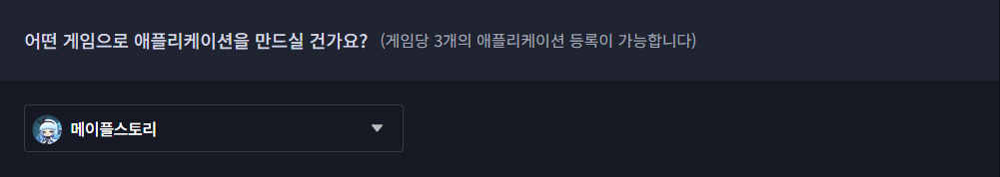
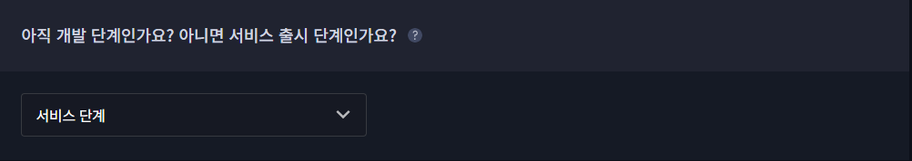
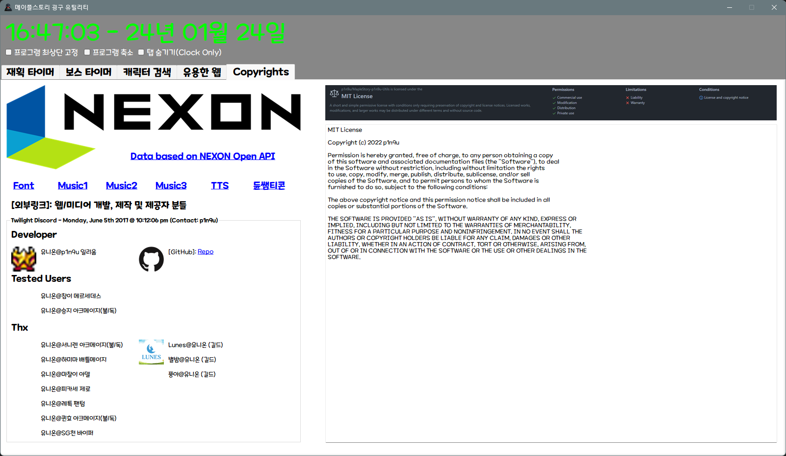
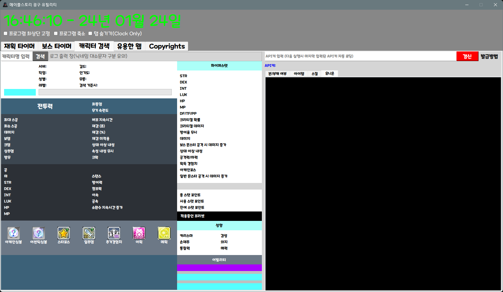
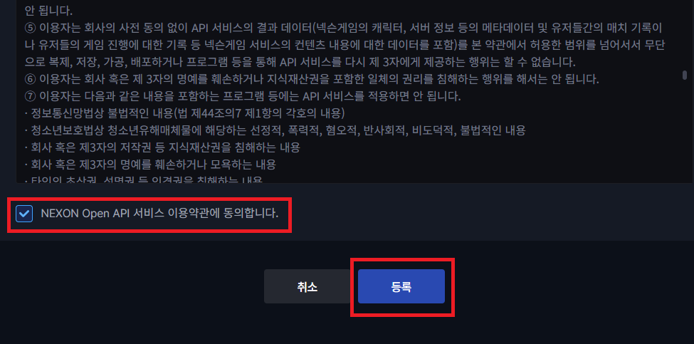
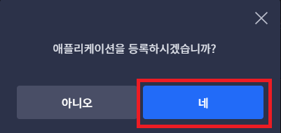
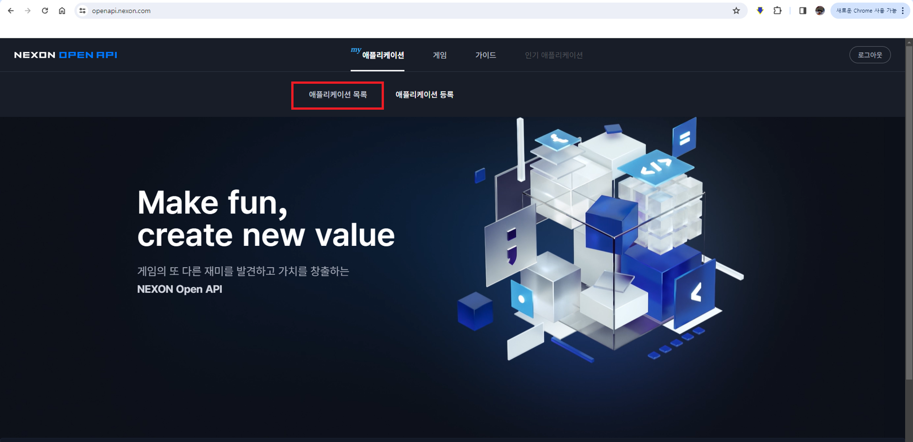
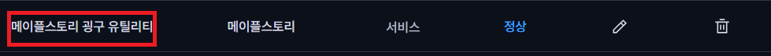
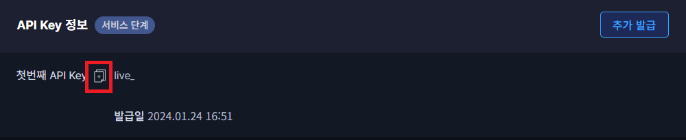
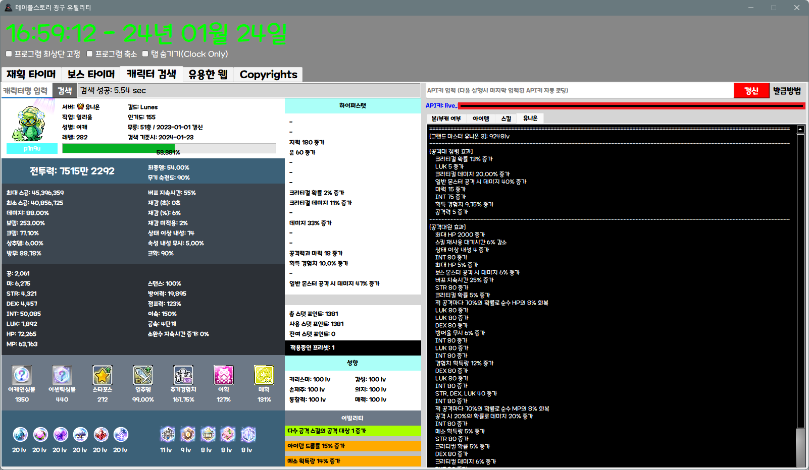

# 넥슨 오픈 API 키 발급 가이드

1. 오픈 API 사이트 이동: [이동하기](https://openapi.nexon.com/)
2. 애플리케이션 → 애플리케이션 등록 클릭 (본인 넥슨아이디 로그인)
    
    
    
3. 게임 선택: 메이플스토리
    
    
    
4. API Key 타입 선택: 서비스 단계
    
    
    
5. 서비스명
    
    ```
    메이플스토리 굉구 유틸리티
    ```
    
6. 개발하고 계시는 환경: 기타(PC App, 서버간 통신 등)
7. URL 정보
    
    ```
    https://github.com/p1n9u/MapleStory-p1n9u-Utils
    ```
    
8. 서비스 소개
    
    ```
    메이플스토리를 플레이 하는데있어 
    유용한 유틸리티 (각종 타이머 등),
    오픈 API를 활용한 정보 검색,
    웹사이트 를 제공하는 프로그램
    ```
    
9. 대표 이미지
    
    
    
    
    
10. 약관동의 체크, 등록 클릭
    
    
    
11. 등록하시겠습니까? → 네 클릭
    
    
    
12. 애플리케이션 → 애플리케이션 목록, 보통 자동으로 이동함(나중에 확인하는 법)
    
    
    
13. 발급받은 애플리케이션 이름 클릭
    
    
    
14. 복사하기 아이콘 클릭, live_*** 으로 시작
    
    
    
15. 프로그램 API 키 입력칸에 붙여넣기 (Ctrl + v) → 갱신클릭 또는 엔터
    
    
    
16. 올바른 키 입력 후 검색시 성공 (한번 입력시, nexon_api_key 폴더의 api_key_lts.txt에 저장됨)
    
    